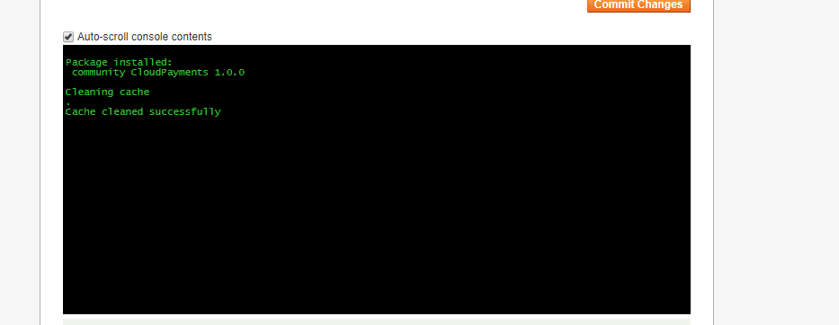
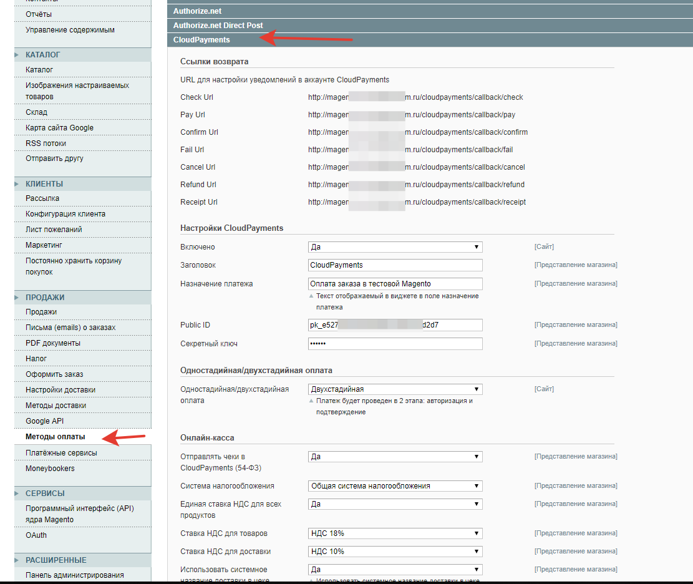
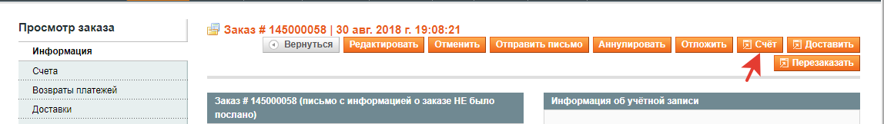
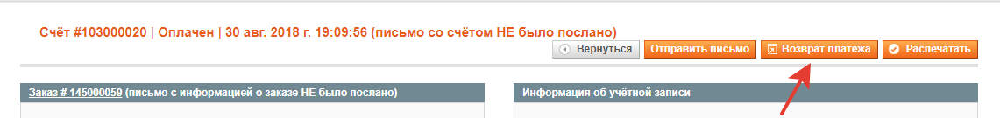

# CloudPayments модуль для Magento
Модуль позволит с легкостью добавить на ваш сайт оплату банковскими картами через платежный сервис CloudPayments. 
Для корректной работы модуля необходима регистрация в сервисе.

Порядок регистрации описан в [документации CloudPayments](https://cloudpayments.ru/Docs/Connect)

### Возможности
* Одностадийная схема оплаты;
* Двухстадийная схема оплаты;
* Выбор локализации виджета оплаты;
* Выбор дизайна виджета оплаты;
* Поддержка онлайн-касс (ФЗ-54);
* Настройка НДС для службы доставки;
* Отправка чеков по email;
* Отправка чеков по SMS;

### Совместимость
Magento v.1.9 и выше;
для Magento v.2.0+ => https://github.com/cloudpayments/CMS-Magento-CP

### Установка модуля

1. В панели администратора зайти в раздел "Система" -> "Magento Connect" -> "Управление расширениями".
2. Загрузить архив CloudPayments-1.0.3.tar.gz в секции "Direct package file upload" и нажать "Upload"

3. Результат успешной установки модуля

### Ручная установка

1. Скопировать каталог upload  в корень Magento.
2. Очистить кэш ("Система" -> "Управление кэшем")
3. Выйдите из панели администрирования
4. Войдите в панель администрирования
5. Если необходимо запустите повторную компиляцию ("Система" -> "Инструменты" -> "Компиляция")

### Настройка модуля

1. Перейти в настройки модуля "Система" -> "Конфигурация". В секции "Продажи" перейдите в "Методы оплаты" и найдите метод "CloudPayments"
2. Укажите следующие настройки:
    * **Включено** — Выбрать "Да"
    * **Заголовок** — Наименование, которое отображается в списке доступных оплат на странице заказа
    * **Назначение платежа** — Текст, отображаемый в виджете оплаты и в квитанции об оплате
    * **Public ID** — Public id сайта из личного кабинета CloudPayments
    * **Секретный ключ** — Пароль для API из личного кабинета CloudPayments
    
    Затем сохранить введенные параметры.
    
    
    
3. В личном кабинете CloudPayments указать URL соответствующих уведомлений из настроек модуля    

### Двухстадийная оплата

В этом режиме оплата происходит в два этапа: авторизация платежа (блокировка суммы на карте покупателя)
и подтверждение списания.
Для включения данного режима в настройке модуля параметр "Одностадийная/двухстадийная оплата" следует установить в "Двухстадийная".

Все заказы после авторизации платежа переходят в статус "Authorized CloudPayments".
Для подтверждения заказа из панели управления Magento необходимо у заказа сформировать счет.

Для отмены (void) необходимо кликнуть по кнопке "Аннулировать".

### Возврат платежа (refund)
Для возврата оплаты необходимо открыть счет у заказа и нажать на кнопку "Возврат платежа"

### Интеграция с онлайн-кассой

Модуль позволяет интегрировать онлайн-кассу при оплате и отменах платежей.
Для этого подключить кассу в личном кабинете CloudPayments https://cloudpayments.ru/Docs/Kassa и указать дополнительные настройки модуля:

* **Отправлять чеки в CloudPayments (54-ФЗ)** — Да
* **Система налогообложения** — Тип системы налогообложения.
Возможные значения перечислены в документации CloudPayments https://cloudpayments.ru/Docs/Directory#taxation-system
* **Единая ставка НДС для всех продуктов** — При включенном параметре для всех товаров будет указана станка НДС из настроек модуля.
Иначе ставка будет браться из свойств товара
* **Ставка НДС для товаров** — Указание ставки НДС для товаров. Параметр действителен только при включении единой ставки НДС
* **Ставка НДС для доставки** — Указание отдельной ставки НДС для доставки.
Если доставка платная, то она в чеке оформляется отдельной строкой со своей ставкой НДС.
* **Использовать системное название доставки в чеке** — При включенном параметре позиция доставки будет иметь значение наименования доставки в Magento
* **Наименование доставки в чеке** — Наименование позиции доставки в чеке. Действительно только при выключенном параметре "Использовать системное название доставки в чеке"

#### Changelog
= 1.0.3 =
* добавление языков локализации виджета оплаты;  
* добавление выбора дизайна виджета;  
* правка значений ставок НДС;  

= 1.0.2 =
* добавление функции логирования;  

= 1.0.1 =
* добавление двухстадийной схемы оплаты;  

= 1.0 =
* Публикация модуля.

